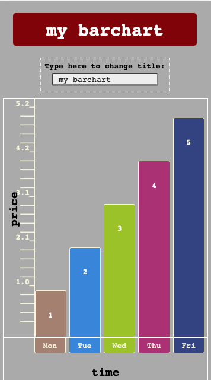
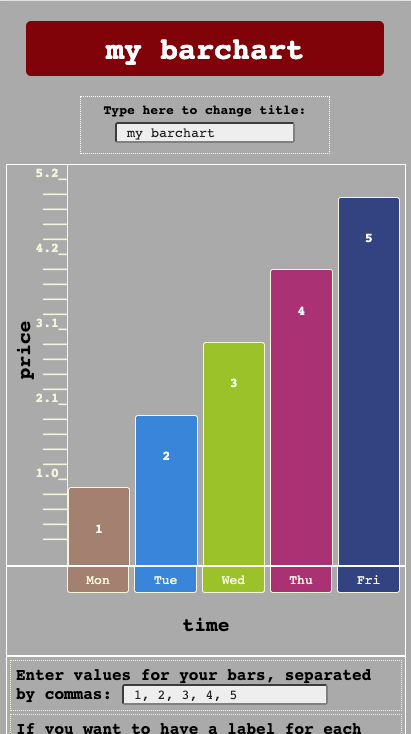
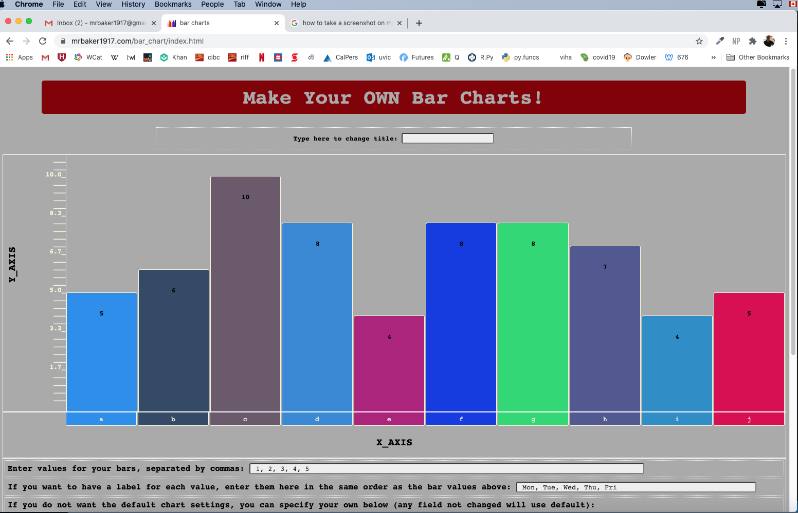

# bar_chart
This is a Lighthouse Labs stretch project.
[Here is the assignment URL:] (https://web.compass.lighthouselabs.ca/activities/718)
### The idea of this project is to make a website that allows users to make bar charts with a lot of options to modify the bars and labels, as well as the title, the latter dynamically.

Example Screenshots:

List the API functions that you would expect a user to use:
[jQuery] (https://api.jquery.com/)

## functions:
The functions are contained in the file bar_charts.js.
  * drawBarChart(data, options, element) - draws the bars and labels in element.
  * randColor() - generates random colors, when user does not specify them.
  * barColor(colors) - uses colors supplied by user to fill bars.
  * makeTicks(str) - makes ticks for y-axis.
  * makeRandArr(num) - generates a random array of specified length (num).

## feature list: Options allow user to do the following:
  * to dynamically change title
  * to change barchart height, title, font-size, font-color
  * to input the data to be presented
  * to label each bar
  * to provide specific colors for bars
  * to change space between bars
  * to specify the color of data points
  * to specify the labels for the x- and y-axes

## known issues:
The main problem at present is I have not figured out how to allow user to change the axes of the chart so bars move left to right, rather than bottom to top.
This is the main feature I need to work on now.

# main resources used to learn to code this project:
  * [Mark Myers, _A Smarter Way to Learn jQuery_ (2015)] (http://www.asmarterwaytolearn.com)
  * [free code camp] (https://www.freecodecamp.org/learn)
  * [w3schools.com] (https://www.w3schools.com/jquery/)
  * [css-tricks.com] (https://css-tricks.com/)

